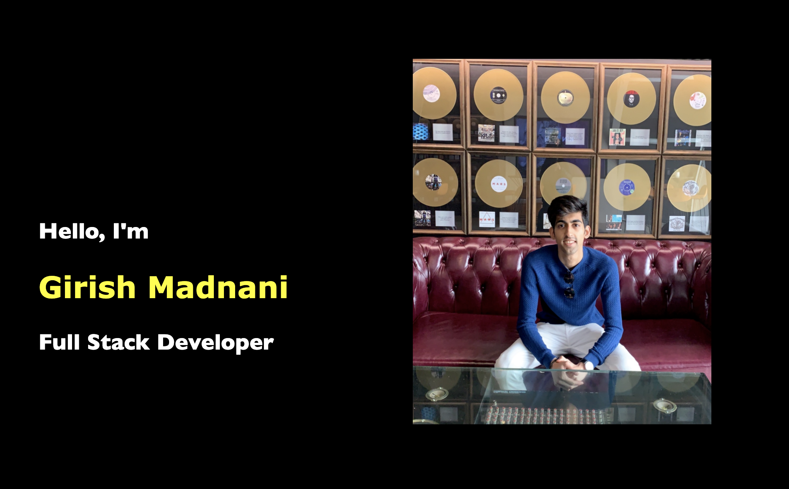
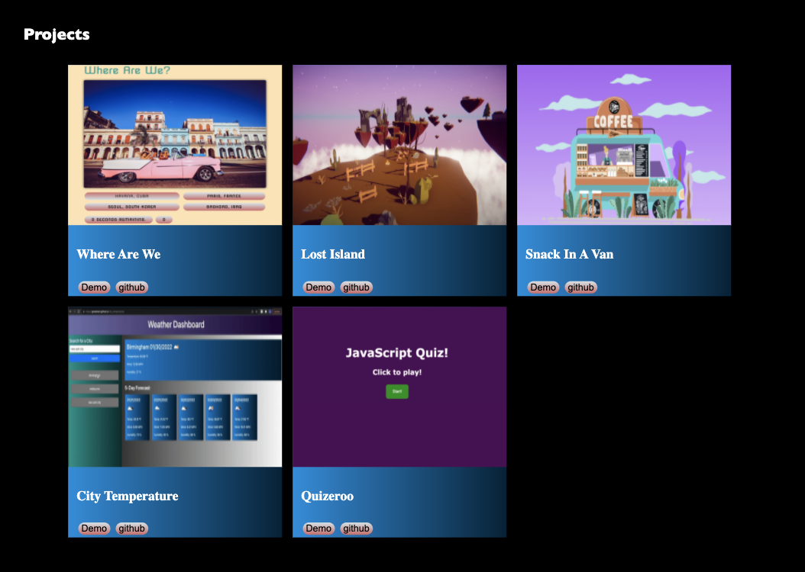

# Just_about_me

## Table of Contents
- [Task](#task)
- [Portfolio Description](#portfolio-description)
- [Images](#images)
- [Website](#website)

## Task
The purpose of this project is to update our portfolio by adding our project 1 and some of our homework assignments. Github and LinkedIn profiles are also linked. 

## Portfolio Description 
The portfolio is about me with a few for my projects attached in it. My Github and LinkedIn profiles are also linked along with with resume. In the project section you can also jumped to its deployed version as well as the github link of the project.

## Images

<figure align="center">
  
</figure>

<figure align="center">
  
</figure>

## Website
https://gmadnani.github.io/Just_about_me/

https://github.com/gmadnani/Just_about_me